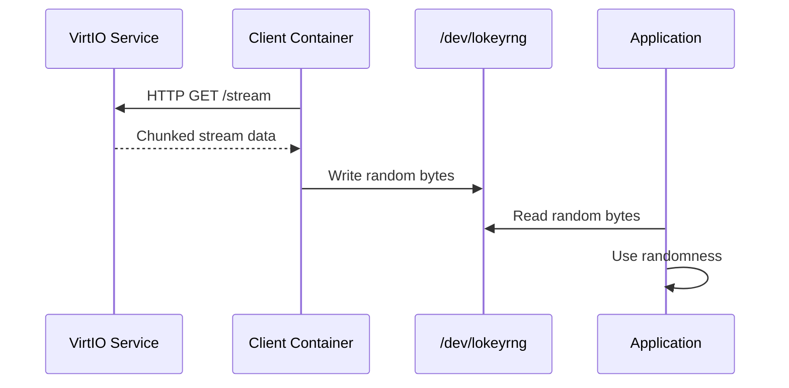

# Architecture

This document describes the architecture of Lokey Client Container.

## System Overview

Lokey Client Container is a lightweight service that connects to Lokey's VirtIO service and feeds random data to character devices. It's designed to work in containerized environments, particularly Kubernetes.

## Components

### 1. VirtIO Client (`pkg/virtio/`)

The VirtIO client handles HTTP streaming from Lokey's VirtIO service:

- **Connection Management**: Establishes and maintains HTTP connection
- **Stream Reading**: Reads chunks of random data from the stream
- **Reconnection Logic**: Automatic reconnection with exponential backoff
- **Health Checks**: Periodic health checks to verify service availability

### 2. Device Writer (`pkg/device/`)

The device writer manages writing to character devices:

- **Multi-Device Support**: Can write to multiple devices simultaneously
- **Error Handling**: Handles device I/O errors gracefully
- **Reconnection**: Automatically reopens devices on failure

### 3. Configuration (`pkg/config/`)

Configuration management:

- **Environment Variables**: Loads configuration from environment
- **Validation**: Validates configuration values
- **Defaults**: Provides sensible defaults

## Data Flow



## Deployment Patterns

### Sidecar Pattern

```
┌─────────────────────────┐
│         Pod             │
│  ┌───────────────────┐ │
│  │  Init Container    │ │  Creates /dev/lokeyrng
│  └───────────────────┘ │
│  ┌───────────────────┐ │
│  │  Client Container  │ │  Feeds device
│  └───────────────────┘ │
│  ┌───────────────────┐ │
│  │  App Container     │ │  Reads from device
│  └───────────────────┘ │
└─────────────────────────┘
```

### Daemonset Pattern

```
┌─────────────────────────┐
│        Node             │
│  ┌───────────────────┐ │
│  │  Client Container  │ │  Feeds /dev/lokeyrng
│  └───────────────────┘ │  (OS-level)
│         │               │
│         ▼               │
│    /dev/lokeyrng        │
│         │               │
│         ▼               │
│  All Pods on Node       │
└─────────────────────────┘
```

## Error Handling

### Network Errors

- Exponential backoff: 1s, 2s, 4s, 8s, max 30s
- Health check before reconnection
- Logs reconnection attempts

### Device I/O Errors

- Logs errors but continues
- Attempts to reopen failed devices
- Continues with other devices if multiple configured

## Security Considerations

- **Non-root User**: Runs as non-root where possible (client container)
- **Minimal Images**: Uses distroless base images for all containers
- **No Shell**: Production images have no shell/utilities
- **Seccomp Profiles**: Restrictive seccomp profiles for enhanced security
- **Read-only**: Can run with read-only root filesystem (except /dev)
- **Capability Dropping**: Only necessary capabilities (MKNOD for init container)

## Performance

- **Throughput**: Limited by network and device I/O
- **Latency**: Minimal buffering for low latency
- **Resource Usage**: ~32-64MB memory, minimal CPU

## Monitoring

- Logs connection status
- Logs bytes written (in DEBUG mode)
- Health check endpoint (via VirtIO service)
- Operator status tracking (injected pods, daemonset status)

## Kubernetes Operator

The operator provides declarative management:

- **Selective Control**: Enable/disable sidecars and daemonsets independently
- **Sidecar Injection**: Automatic injection based on selectors
- **Daemonset Management**: Node-level randomness deployment
- **Status Tracking**: Monitors injection counts and deployment status

See [Operator Documentation](operator.md) for details.