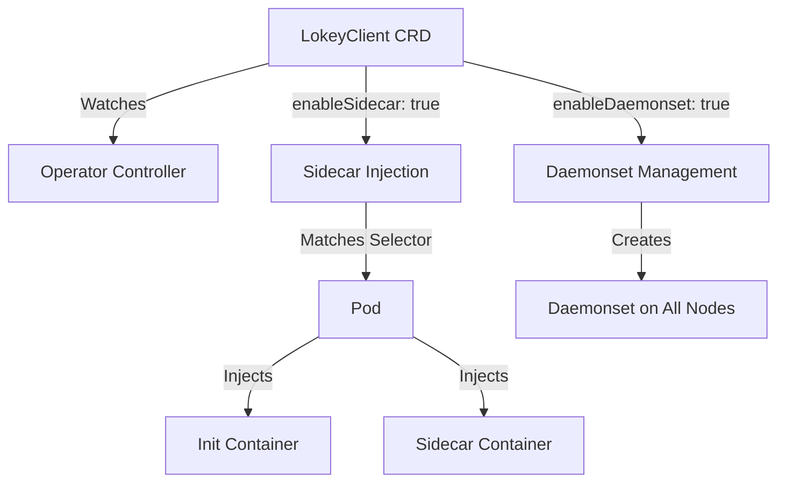

# Kubernetes Operator

The Lokey Client Container operator provides declarative management of randomness injection in Kubernetes clusters.

## Overview

The operator watches for `LokeyClient` custom resources and can selectively:
- Inject sidecar containers into pods based on selectors (when `enableSidecar: true`)
- Manage daemonsets for node-level randomness (when `enableDaemonset: true`)
- Track injection status and metrics

## Installation

### Prerequisites

- Kubernetes cluster (1.20+)
- kubectl configured
- CRDs installed

### Install CRDs

```bash
kubectl apply -f config/crd/bases/lokey.io_lokeyclients.yaml
```

### Install Operator

```bash
kubectl apply -f config/manager/manager.yaml
kubectl apply -f config/rbac/role.yaml
kubectl apply -f config/rbac/role_binding.yaml
kubectl apply -f config/rbac/service_account.yaml
```

Or use the Helm chart:

```bash
helm install lokey-client ./examples/helm/lokey-client
```

## Usage

### Selective Control

The operator supports selective control over daemonsets and sidecars:

- **`enableDaemonset: true`** - Creates/manages a daemonset for node-level randomness
- **`enableSidecar: true`** - Enables automatic sidecar injection into pods
- **Both can be enabled** - Use sidecars for specific pods and daemonset for node-level access
- **Both disabled** - No resources created (useful for testing or gradual rollout)

**Default behavior**: If both flags are omitted or `false`, no resources are created.

#### Use Cases

- **Sidecar Only** (`enableSidecar: true, enableDaemonset: false`):
  - Inject randomness into specific security-sensitive pods
  - Per-pod isolation and control
  - No node-level changes required
  - Best for: Application-specific randomness needs

- **Daemonset Only** (`enableSidecar: false, enableDaemonset: true`):
  - Provide randomness at the OS/node level
  - All pods on the node can access `/dev/lokeyrng`
  - Requires root/privileged access
  - Best for: Node-wide randomness, system-level services

- **Both** (`enableSidecar: true, enableDaemonset: true`):
  - Sidecars for specific pods + node-level access
  - Maximum flexibility
  - Best for: Mixed environments with different requirements

### Create LokeyClient Resource

#### Sidecar Only

```yaml
apiVersion: lokey.io/v1
kind: LokeyClient
metadata:
  name: lokey-client-sidecar
spec:
  virtioUrl: "http://lokey-virtio:8083"
  enableSidecar: true
  enableDaemonset: false
  devicePaths:
    - "/dev/lokeyrng"
  podSelector:
    matchLabels:
      lokey.io/inject: "true"
```

#### Daemonset Only

```yaml
apiVersion: lokey.io/v1
kind: LokeyClient
metadata:
  name: lokey-client-daemonset
spec:
  virtioUrl: "http://lokey-virtio:8083"
  enableSidecar: false
  enableDaemonset: true
  devicePaths:
    - "/dev/lokeyrng"
    - "/dev/hwrng"
```

#### Both Sidecar and Daemonset

```yaml
apiVersion: lokey.io/v1
kind: LokeyClient
metadata:
  name: lokey-client-both
spec:
  virtioUrl: "http://lokey-virtio:8083"
  enableSidecar: true
  enableDaemonset: true
  devicePaths:
    - "/dev/lokeyrng"
  podSelector:
    matchLabels:
      lokey.io/inject: "true"
```

### Sidecar Injection

When `enableSidecar: true`, the operator can automatically inject sidecars into pods based on:

1. **Annotations**: Add `lokey.io/inject: "true"` to pod annotations
2. **Labels**: Match pods using `podSelector`
3. **Namespace**: Match namespaces using `namespaceSelector`

**Note**: Sidecar injection requires `enableSidecar: true`. If `enableSidecar: false` or omitted, no sidecars will be injected.

Example pod with annotation:

```yaml
apiVersion: v1
kind: Pod
metadata:
  name: my-app
  annotations:
    lokey.io/inject: "true"
spec:
  containers:
  - name: app
    image: my-app:latest
```

The operator will automatically inject:
- Init container (creates `/dev/lokeyrng`)
- Sidecar container (feeds device)

### Daemonset Management

When `enableDaemonset: true`, the operator creates and manages a daemonset for node-level randomness. The daemonset runs on all nodes and provides `/dev/lokeyrng` and `/dev/hwrng` at the OS level.

When `enableDaemonset: false` or omitted, no daemonset is created. If a daemonset was previously created, it will be deleted.

## Configuration

### LokeyClient Spec

| Field | Type | Description | Default |
|-------|------|-------------|---------|
| `virtioUrl` | string | VirtIO service URL | Required |
| `enableDaemonset` | bool | Enable daemonset deployment | `false` |
| `enableSidecar` | bool | Enable sidecar injection | `false` |
| `devicePaths` | []string | Device paths | `["/dev/lokeyrng"]` |
| `chunkSize` | int | Stream chunk size | `1024` |
| `reconnectInterval` | string | Reconnection interval | `"5s"` |
| `injectionMode` | string | Injection mode | `"annotation"` |
| `namespaceSelector` | LabelSelector | Namespace selector | nil |
| `podSelector` | LabelSelector | Pod selector | nil |
| `resources` | ResourceRequirements | Resource limits | Defaults |
| `image` | string | Container image | `ghcr.io/lokey/client-container:latest` |
| `initImage` | string | Init container image | `ghcr.io/lokey/client-container-init:latest` |

### Status

The operator updates the `LokeyClient` status with:
- `injectedPods`: Count of pods with injected sidecars
- `daemonsetStatus`: Daemonset deployment status
- `lastSyncTime`: Last reconciliation time
- `conditions`: Status conditions

## Troubleshooting

### Check Operator Logs

```bash
kubectl logs -n lokey-system deployment/lokey-client-operator
```

### Check CRD Status

```bash
kubectl get lokeyclient
kubectl describe lokeyclient lokey-client-default
```

### Check Injected Pods

```bash
kubectl get pods -A -l lokey.io/injected=true
```

## Architecture



## Security

### Seccomp Profiles (Optional)

Seccomp profiles can be optionally enabled for enhanced security. When `enableSeccomp: true` is set in the `LokeyClient` spec:

- **Init Containers**: Uses `lokey-client-init-container.json` profile
- **Sidecar Containers**: Uses `lokey-client-container.json` profile
- **Daemonset Containers**: Uses `lokey-client-container.json` profile

**Default**: Seccomp profiles are **disabled by default** (`enableSeccomp: false` or omitted).

**Prerequisites**: If enabling seccomp, profiles must be installed on Kubernetes nodes before the operator can use them. See [Seccomp Profiles](seccomp.md) for installation instructions.

**Example**:

```yaml
apiVersion: lokey.io/v1
kind: LokeyClient
metadata:
  name: lokey-client-secure
spec:
  virtioUrl: "http://lokey-virtio:8083"
  enableSidecar: true
  enableSeccomp: true  # Enable seccomp profiles
  devicePaths:
    - "/dev/lokeyrng"
```

**Note**: Only enable seccomp if profiles are installed on all nodes. Pods will fail to start if profiles are missing.

## RBAC

The operator requires the following permissions:
- CRD management (lokey.io/lokeyclients)
- Pod management (get, list, watch, patch)
- Daemonset management (create, update, delete, get, list, watch)

See `config/rbac/role.yaml` for details.
